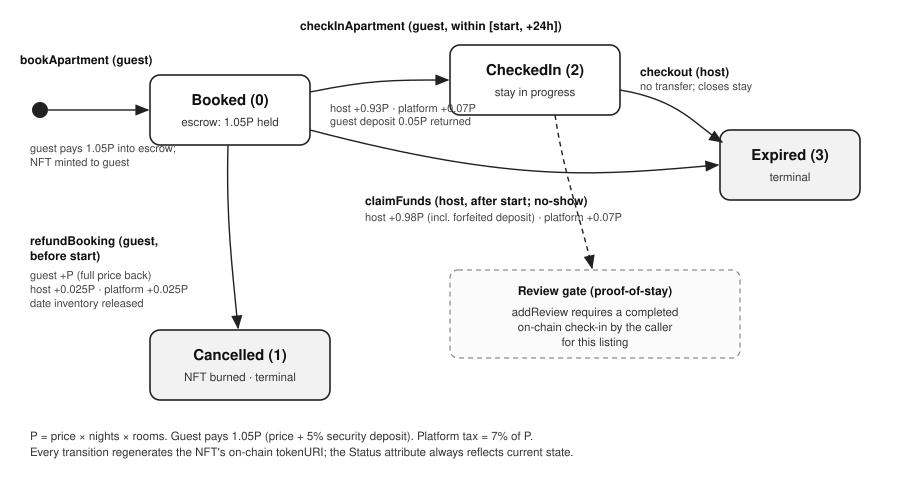
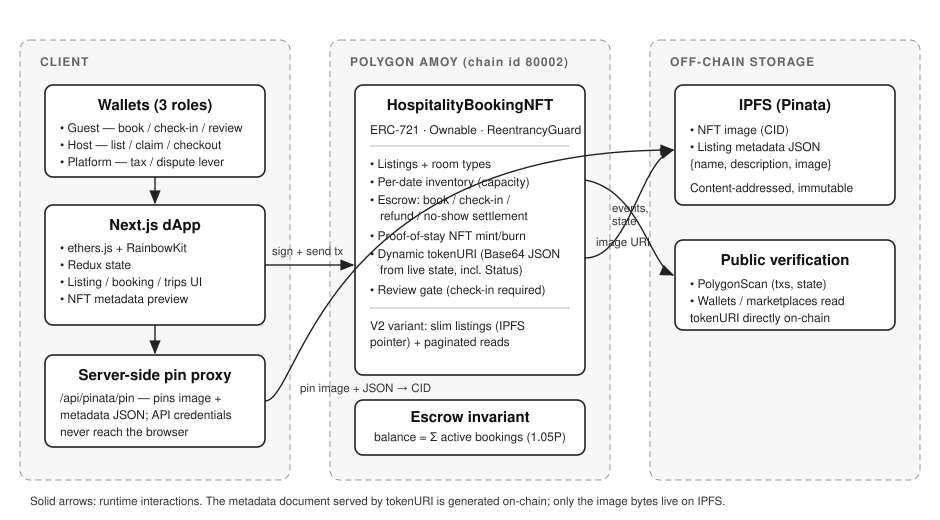
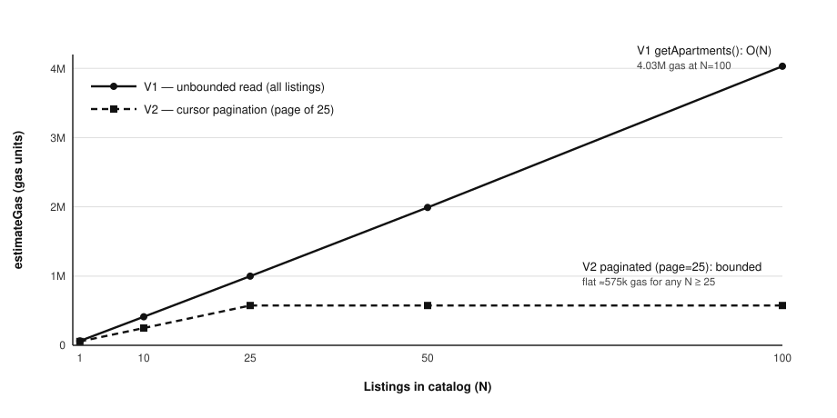

# Verifiable Reviews from Proof-of-Stay NFTs: An On-Chain Review-Integrity Mechanism for Decentralized Accommodation Booking

**Authors:** _[Your Name]_, _[Co-authors]_
**Affiliation:** _[Department, University]_
**Contact:** _[email]_

> **Draft status.** Working manuscript from a verified reference implementation,
> framed around **review integrity** as the central contribution (supporting
> measurements are secondary). Numbers labelled "Hardhat EVM" are from a local
> deterministic environment; live results are from Polygon Amoy and are publicly
> verifiable (Appendix A). Remaining before submission: author metadata;
> venue-specific citation formatting; (recommended) a statistical gas campaign on
> the live testnet; and (optional, to strengthen the core contribution) an
> implemented-and-evaluated value-weighting or identity mitigation for the
> self-review attack analyzed in §6. Target: an applied blockchain conference
> (e.g., BLOCKCHAIN Congress or IEEE ICBC short paper), the tier of ref. [3].

---

## Abstract

Fabricated and manipulated reviews are a persistent, well-documented weakness of
centralized accommodation platforms, and decentralization alone does not fix it:
recent on-chain NFT-rental systems tokenize *access rights* but leave the
review corpus untreated. We present a mechanism that makes a guest review
**verifiable at its source**. Each booking mints an ERC-721 *proof-of-stay* token
whose metadata is generated entirely on-chain and advances by guest and host
*actions* across the reservation lifecycle (Booked → Checked-In →
Expired/Cancelled); the right to review a listing is conferred only by a
completed, publicly auditable on-chain check-in recorded in that lifecycle. We
analyze the mechanism's security honestly — it guarantees *verified-stay
provenance* (every review binds to a real, paid booking) rather than full
sybil-resistance — and we quantify the on-chain cost of its residual attack, host
self-review collusion, showing it can be priced up but not eliminated without an
identity layer. The mechanism is realized within a complete, escrow-backed
booking system implemented in Solidity with a Next.js front end and deployed to
a public Ethereum-compatible test network; the full lifecycle, including the
review gate and all fund settlements, is executed on-chain across three distinct
wallet roles and shown to conserve funds exactly. Supporting measurements —
per-operation gas and fiat cost, an economic break-even analysis against OTA
commissions, a 47.9% listing-storage optimization, and randomized invariant
verification — establish that verifiable-review provenance is affordable on
Layer-2. We position the work precisely against deployed NFT-rental systems that
provide no review mechanism, and against the debate over whether NFTs belong in
hotel distribution at all.

**Keywords:** review integrity, proof-of-stay, blockchain, smart contracts, NFT,
ERC-721, hospitality, decentralized applications, sybil resistance, gas cost.

---

## 1. Introduction

Guest reviews are the trust backbone of online accommodation markets, and their
manipulation is a chronic, well-documented problem: fabricated positive reviews,
paid review farms, and retaliatory or fake negative reviews all distort the
signal that drives bookings. Centralized platforms mitigate this only partially
and opaquely, through proprietary detection that users cannot audit. A natural
hope is that moving bookings on-chain would make reviews trustworthy by
construction — but it does not follow automatically. Recent decentralized
NFT-rental systems tokenize a *booking* or an *access right*, yet still either
omit reviews or would inherit the same "anyone can post" weakness if they added
them. The question we ask is narrow and, we argue, under-served: **can a review
be made verifiable at its source — provably tied to a real, completed stay —
using only on-chain state?**

We answer with a *proof-of-stay* construction. Each booking mints an ERC-721
token whose metadata is assembled on-chain from live contract state, so the
token's status advances by guest and host *actions* across the reservation
lifecycle (Booked → Checked-In → Expired/Cancelled) with no metadata server and
no re-mint. The right to review a listing is conferred only by a completed,
publicly auditable on-chain **check-in** recorded in that lifecycle — so every
review is bound to a real, paid, inspectable booking. We are precise about what
this buys: it establishes *verified-stay provenance*, not full sybil-resistance,
because a host can still book their own listing; we quantify the on-chain cost of
that residual collusion and discuss where an identity layer would be required to
close it. The construction is embedded in a complete escrow-backed booking
system so that the review gate can be evaluated end-to-end — under real
settlement, cancellation, and no-show flows — rather than in isolation.

**Contributions.**

1. **An on-chain review-integrity mechanism** (§3.3, §3.5): reviews gated by a
   verifiable proof-of-stay check-in recorded in a dynamic, on-chain NFT
   lifecycle — a property absent from deployed NFT-rental systems [3], which
   provide no review mechanism at all.
2. **An honest security analysis of the mechanism** (§6): we characterize its
   guarantee as verified-stay provenance, identify host self-review collusion as
   the residual attack, and quantify its on-chain cost, delimiting what the
   mechanism does and does not defend against.
3. **An end-to-end, publicly verifiable realization** (§4, §5.6): the mechanism
   is implemented within a full escrow-backed lifecycle and executed live on
   Polygon Amoy across three wallet roles, with every NFT state transition and
   exact fund conservation confirmed on-chain via linked transactions.
4. **Supporting feasibility evidence** (§5): per-operation gas/fiat cost, a
   break-even analysis showing verifiable reviews are affordable on Layer-2, a
   47.9% listing-storage optimization, and randomized invariant verification of
   fund conservation.

We are explicit about scope. The underlying booking system is derived from an
open-source tutorial project (§4.1); our claimed contribution is the review-
integrity mechanism and its honest evaluation, not the base application, and not
decentralized booking, escrow, NFT rentals, or deployment-and-measurement as
such — deployed, measured NFT-rental systems already exist [3]. We do not claim
full sybil-resistance, production-readiness, or demonstrated real-user adoption.

---

## 2. Background and Related Work

### 2.1 Blockchain-based booking systems

Decentralized booking has an established literature. A blockchain-based
decentralized booking system formally modeled and machine-verified its protocol
[1]. More recent work integrates incentivized data sharing and smart contracts
for hotel reservations [2], and proof-of-concept dApps for short-term
accommodation have been deployed and gas-benchmarked across Ethereum and IOTA
[3]. These systems establish feasibility of on-chain reservation, payment, and
NFT issuance; none, to our reading, ties review eligibility to a verifiable
on-chain stay, and their booking lifecycles do not model an explicit,
fund-conservation-verified check-in/refund/no-show settlement.

### 2.2 NFTs in hospitality

An influential strand proposes NFTs as the booking instrument, arguing they
enable a transferable secondary market for reservations and richer loyalty
mechanics [4]; a 2024 critique responds that NFT-based hotel distribution is a
"misguided development," questioning whether tokenization adds value over
conventional records and highlighting volatility, custody, and usability
concerns [5]. Between these poles, Košťál et al. [3] provide the most concrete
point to date — a deployed rental dApp whose NFTs are *expirable* (ERC-7858) or
*soulbound* access rights, benchmarked on Ethereum and IOTA. Their tokens govern
time-limited access; they do not encode a verifiable *stay record*, and their
system implements no reviews. We engage the [5] critique directly in §6.

### 2.3 The gap we target

Systematic reviews of blockchain and NFTs in tourism report that structured,
empirical evaluation of real implementations is still limited relative to the
volume of conceptual work [6], [7], [8]. But the more specific gap we target is
narrower and, we argue, more defensible: even the deployed NFT-rental systems
[3] do not address *review integrity*, though fabricated reviews are a central
criticism of the centralized platforms these systems aim to displace. We
contribute a proof-of-stay construction that makes review provenance verifiable,
and measure its cost.

### 2.4 Enabling standards and tools

Our implementation uses the ERC-721 non-fungible token standard and OpenZeppelin
reference contracts for access control, reentrancy protection, and Base64/JSON
utilities. Off-chain image assets are pinned to IPFS. Static analysis uses
Slither. These are engineering choices, not contributions.

### 2.5 Positioning

Table 0 positions this work against the published systems closest to it. The
nearest is Košťál et al. [3], a deployed NFT-based rental dApp; we credit its
capabilities explicitly and claim only the rows where we genuinely differ.
Cells marked "n.r." (not reported) reflect what the respective publications
describe; absence of a report is not proof of absence.

**Table 0. Feature and evaluation comparison with closest published systems.**

| Capability | KER 2020 [1] | IEEE MI-STA 2024 [2] | Košťál et al. 2025 [3] | dappBnb (base) [9] | **This work** |
|---|---|---|---|---|---|
| On-chain booking + escrow | ✓ | ✓ | ✓ | ✓ | ✓ |
| Per-booking NFT | ✗ | n.r. | ✓ (expirable ERC-7858 / soulbound) | ✗ | ✓ (ERC-721) |
| NFT semantics | — | — | time-limited *access right* | — | *proof-of-stay*, action-driven status |
| Dynamic on-chain metadata by lifecycle *action* | ✗ | ✗ | ✗ (time-expiry only) | ✗ | ✓ |
| Explicit check-in / checkout / no-show / refund settlement | partial | n.r. | ✗ (reserve → auto-expire → withdraw) | partial | ✓ |
| Review gating by verified on-chain stay | ✗ | n.r. | ✗ (no reviews) | ✗ | ✓ |
| Room capacity / pricing controls | n.r. | n.r. | ✓ (seasons, capacity) | ✗ | ✓ (per-date) |
| Marketplace-read scaling approach | n.r. | n.r. | contract-per-listing (factory) | unbounded loop | bounded pagination |
| Per-operation gas evaluation | ✗ | n.r. | ✓ (Ethereum vs. IOTA) | ✗ | ✓ (+ V1/V2 optimization, −47.9%) |
| Static security analysis (Slither) | ✗ | n.r. | ✓ | ✗ | ✓ |
| Unit tests | n.r. | n.r. | ✓ | ✗ | ✓ |
| Randomized invariant / fund-conservation fuzzing | formal model-checking | ✗ | ✗ | ✗ | ✓ |
| Live public-network validation | ✗ | n.r. | ✓ (Sepolia + IOTA) | ✗ | ✓ (Amoy, tx-linked) |
| Economics vs. centralized platform | ✗ | ✗ | ✓ (Airbnb-scale infra) | ✗ | ✓ (per-booking break-even) |

The comparison is deliberately conservative: [3] already provides a deployed,
gas-measured, Slither-analyzed, NFT-based rental system with a platform-cost
argument, and [1] provides formal protocol verification. We therefore do **not**
claim novelty for on-chain NFT booking, deployment-and-measurement, or security
analysis as such. Our distinct elements are three: (i) an NFT that carries
*proof-of-stay lifecycle status* driven by check-in/checkout actions, as opposed
to [3]'s time-expirable *access* token; (ii) an on-chain **review-integrity
gate** — absent from [3], which implements no reviews; and (iii) a
**fund-conservation-verified** settlement lifecycle (check-in, cancellation
refund with collateral split, no-show claim) established by randomized invariant
fuzzing and a tx-linked live run. Where [3] asks "which ledger is cheaper to run
this on," we ask "can proof-of-stay provide verifiable review provenance, and at
what cost." Their bounded-scaling factory pattern and our pagination are
alternative solutions to the same read-cost problem (§5.3).

---

## 3. System Design

### 3.1 Actors

- **Host** — lists a property, defines room types and prices, receives payout,
  and settles no-shows.
- **Guest (tenant)** — books a room, pays into escrow, checks in, may cancel for
  a refund before the stay, and may review after a completed check-in.
- **Platform (contract owner)** — collects a percentage tax on settled stays and
  holds a constrained dispute lever (§6). No party can unilaterally seize a
  guest's escrowed funds outside the defined settlement paths.

### 3.2 Data model

A **listing** stores identity and descriptor fields and one or more **room
types**, each with a per-night price (in wei) and a capacity. A **booking**
records the guest, room type, requested nights (as normalized day timestamps),
price, escrow, the minted token id, and a status enum
{Booked, Cancelled, CheckedIn, Expired}. Per-date occupancy is tracked in a
`roomType → date → count` mapping that enforces capacity.

### 3.3 Proof-of-stay NFT with dynamic on-chain metadata

Booking mints an ERC-721 token to the guest. Crucially, the token's metadata is
**not** stored as a static file; `tokenURI` builds a Base64-encoded JSON
document on every read from current contract state, embedding the apartment name,
room type, check-in/out dates, night count, and the live booking **status**. As
the booking transitions (e.g., a check-in call flips status to *Checked-In*), the
token's metadata reflects the new state on the next read, with no re-mint and no
metadata server. Only the NFT *image* is stored off-chain (IPFS); the metadata
document itself is trustless and always consistent with contract state.

### 3.4 Booking lifecycle and escrow

Figure 1 shows the lifecycle as a state machine with its fund flows.

On booking, the
guest transfers `price × nights × rooms + securityFee` into escrow. Three
terminal paths exist:

- **Check-in** (guest, within the stay window): the host receives the price
  minus platform tax; the platform receives the tax; the guest's security
  deposit is returned. Status → *Checked-In*. A subsequent host **checkout**
  marks the booking *Expired*.
- **No-show claim** (host, after the stay start): the host receives price minus
  tax plus the forfeited deposit; the platform receives the tax. Status →
  *Expired*.
- **Cancellation refund** (guest, before the stay): the guest is refunded the
  full price; the security deposit is split evenly between host and platform as
  cancellation collateral; the NFT is burned and the date released. Status →
  *Cancelled*.

All state changes precede external transfers (checks-effects-interactions), and
settlement functions are reentrancy-guarded.

### 3.5 Review integrity via proof-of-stay (core mechanism)

This is the paper's central mechanism. The goal is a review whose *provenance* is
verifiable from on-chain state alone, without trusting a platform operator.

**Threat model.** We consider three adversaries against the review corpus:
(A) a *third party* with no booking who wishes to post reviews (the dominant
attack on centralized platforms, where an account is free); (B) a *host*
inflating their own listing's rating; and (C) *colluding hosts* who review each
other. The defender is any reader who wants to weight reviews by trustworthiness
using only public chain data. We assume the underlying chain is honest-majority
and that off-chain identity is unavailable (permissionless setting).

**Mechanism.** Review eligibility is bound to the proof-of-stay lifecycle of
§3.3. `addReview(aid, text)` requires the caller to hold a completed check-in
record for listing `aid` — established when `checkInApartment` (callable only by
the booking's guest, only within the on-chain stay window) advances the guest's
booking to *Checked-In*. Thus every accepted review is transitively bound to a
specific booking that was *paid for*, *reserved on a real date*, and *checked in*
— all publicly auditable. Eligibility is deliberately tied to check-in (a
guest-controlled action) rather than to checkout (a host-controlled action): the
alternative would let a host suppress a negative review by withholding checkout,
so we accept the weaker precondition to remove that griefing vector.

**Guarantee.** The mechanism provides *verified-stay provenance*: a review's
existence proves a completed, paid booking by the reviewing address. This fully
defeats adversary (A) — third-party review spam now costs a real booking rather
than a free account — and makes every review's backing publicly inspectable,
which no centralized platform offers. It does **not** provide sybil-resistance
against adversaries (B) and (C): a host can book their own listing. Critically,
however, on-chain the fake is not free and not invisible — it costs the
non-refundable platform tax on a real booking and leaves a permanent, auditable
trail (a booking by an address linkable to the host). §6 quantifies this cost and
discusses the identity-layer or value-weighting extensions that would raise it
further. We state this boundary explicitly rather than overclaim sybil-resistance
the construction does not deliver.

### 3.6 Inventory and double-booking prevention

Each requested date is validated against the room type's capacity via the
occupancy mapping; a date at capacity is rejected. Refunds and cancellations
decrement occupancy, releasing the date. This makes double-booking beyond
capacity infeasible by construction (verified in §5.5).

---

## 4. Implementation

### 4.1 Provenance and scope

The application is derived from the open-source *dappBnb* tutorial project
(MIT-licensed) [9]. We disclose this explicitly. Our additions — the proof-of-stay
NFT with dynamic on-chain metadata, the room-type inventory model, the
lifecycle/escrow settlement paths, the review-integrity gate, a storage-optimized
contract variant, and the full evaluation and verification harness — constitute
the contribution. Base scaffolding (wallet connection, listing UI, project
structure) is not claimed as novel.

### 4.2 Stack

The smart contract is written in Solidity 0.8.20 (optimizer enabled, `viaIR`),
using OpenZeppelin `Ownable`, `ReentrancyGuard`, `ERC721`, and Base64/Strings
utilities. The front end is a Next.js/React application using ethers.js and
RainbowKit for wallet interaction; listing and NFT images are pinned to IPFS via
a server-side Pinata proxy that keeps API credentials off the client. Figure 2
shows the overall architecture.

### 4.3 Two contract variants

We evaluate two variants to isolate a storage design choice (§5.2):

- **V1** stores full listing descriptors and NFT name/description/image strings
  on-chain (nine string fields per listing).
- **V2** stores a slim listing (name, location, one image URI, and a single IPFS
  metadata pointer — four string fields) and replaces unbounded reads with
  cursor-paginated ones. Booking and settlement logic are identical to V1 so
  that measured differences isolate the storage design.

### 4.4 Deployment

The contract is deployed to Polygon Amoy (chain id 80002). Amoy is the current
Sepolia-anchored Polygon PoS testnet with ~2 s blocks and negligible base fee,
representative of the low-cost L2/side-chain environment that a consumer booking
dApp would realistically target.

---

## 5. Evaluation

### 5.1 Methodology

We measure per-operation gas two ways. The primary figures (Table 1) come from a
deterministic Hardhat EVM across five iterations under controlled state,
reporting the mean, so operations are compared on equal footing. We additionally
recover the *actual* gas of representative operations from the confirmed Polygon
Amoy transactions of our live run (Table 4b, tx hashes in Appendix A), which
corroborates the local figures on a real network. Because EVM gas is
deterministic given contract state, the two agree up to state-dependent effects
(cold vs. warm storage slots), which we note where they differ. Fiat projections
apply three explicit fee scenarios to the measured gas. Correctness is
established by a unit suite and a randomized invariant fuzzer (§5.5); security by
static analysis (§5.4).

### 5.2 Per-operation gas cost and the metadata optimization

Table 1 reports mean gas per operation for V1 and V2 (Hardhat EVM, n = 5).

**Table 1. Gas per operation (mean, Hardhat EVM).**

| Operation | V1 gas | V2 gas | Reduction |
|---|---|---|---|
| deploy | 5,378,537 | 4,841,593 | 10.0% |
| create listing | 716,798 | 373,567 | **47.9%** |
| add room type | 169,609 | 169,587 | ~0% |
| book (1 night) | 427,039 | 427,017 | ~0% |
| book (3 nights) | 519,285 | 519,263 | ~0% |
| book (7 nights) | 708,621 | 708,599 | ~0% |
| `tokenURI` (view) | 137,576 | 140,624 | −2.2% |
| refund (3 nights) | 126,384 | 126,384 | 0% |
| check-in | 116,856 | 116,856 | 0% |
| checkout | 35,452 | 35,452 | 0% |
| add review | 187,512 | 187,512 | 0% |
| no-show claim | 89,482 | 89,482 | 0% |

Moving static listing/NFT descriptors off-chain (V1→V2) reduces listing-creation
gas by **47.9%** (716,798 → 373,567) and deployment gas by 10%, while leaving
booking and settlement costs unchanged — confirming the saving is isolated to
listing storage. The dynamic `tokenURI` costs ~137k gas as a view call, i.e.,
free to read off-chain; its slight V2 increase (+2.2%) reflects the added
external-URL field.

### 5.3 Read scaling

The O(n) cost of iterating a growing listing set is known; Košťál et al. [3]
avoid it by deploying one contract per listing via a factory, trading a
per-listing deployment cost for bounded reads. We quantify the naive
single-contract baseline and evaluate a different point in the design space —
keeping a single contract (simpler indexing, one address to track) but replacing
the unbounded read with cursor pagination. `getApartments()` in V1 returns all
listings in one unbounded loop; its cost grows linearly and reaches ~4.03M gas
at 100 listings, approaching block-gas limits. V2's paginated read is bounded by
page size and stays flat.

**Table 2. Marketplace read cost vs. catalog size (estimateGas).**

| Listings | V1 `getApartments` | V2 paginated (page 25) |
|---|---|---|
| 1 | 63,025 | 55,169 |
| 10 | 411,922 | 249,589 |
| 25 | 998,739 | 575,046 |
| 50 | 1,991,551 | 575,052 |
| 100 | 4,032,611 | 575,052 |

Neither approach is strictly superior: the factory pattern [3] gives O(1) reads
per listing at the cost of a separate deployment per listing (their measured
RentalUnit deployment is ~2.44M gas), while single-contract pagination avoids
per-listing deployment at the cost of paged reads. We report the pagination
point as a practical alternative, not as a novel discovery of the underlying
O(n) issue (Figure 3).

### 5.4 Fiat cost and the disintermediation argument

Applying explicit fee scenarios to the measured gas, Table 3 shows the cost of a
complete one-night guest interaction (book + check-in ≈ 544k gas).

**Table 3. Cost of one booking (book + check-in) under fee scenarios.**

| Scenario | Assumptions | Cost |
|---|---|---|
| Ethereum L1 | 20 gwei, ETH=$3000 | ~$32.6 |
| Polygon PoS | 30 gwei, POL=$0.40 | **~$0.0065** |
| Arbitrum One | 0.1 gwei, ETH=$3000 | ~$0.16 |

On an L2/side-chain, the total on-chain cost of a booking is a small fraction of
a cent, against the 15–30% commission an OTA charges on the same reservation
(e.g., $15–$30 on a $100/night stay). The comparison is decisive on L2 and
clearly unfavorable on Ethereum L1 — which is precisely why an L2/side-chain is
the appropriate deployment target and why we deploy to Polygon. We report this
honestly rather than selecting only the favorable regime.

**Sensitivity analysis.** To make the comparison robust rather than anecdotal,
we compute the break-even nightly rate — the rate at which the on-chain guest
flow costs as much as the OTA commission — across stay lengths and commission
levels (Table 3b; full tables in the artifact, `benchmarks/econ-analysis.md`).

**Table 3b. Break-even nightly rate (on-chain cost = commission).**

| Network | 1 night, vs 15% | 3 nights, vs 15% | 7 nights, vs 15% |
|---|---|---|---|
| Ethereum L1 | $217.56 | $84.82 | $47.17 |
| Arbitrum One | $1.09 | $0.42 | $0.24 |
| Polygon PoS | $0.04 | $0.02 | <$0.01 |

On Polygon-class fees, on-chain settlement is cheaper than a 15% commission for
any nightly rate above four cents — i.e., always. On Arbitrum-class fees the
threshold is ~$1/night — again, effectively always. On Ethereum L1 the flow
($33–$50) undercuts a 15% commission only above ~$218/night for one-night stays
(~$47/night for week-long stays), quantifying precisely why L1 is the wrong
deployment target for low-value bookings. Caveats: token and gas prices are
volatile and the figures use the stated assumptions; host-side listing costs
(amortized over bookings) and fiat on/off-ramp frictions are excluded, the
latter applying asymmetrically to the two models.

### 5.5 Correctness and robustness

The unit suite comprises 36 passing tests covering listing CRUD, room-type
management, booking with exact-payment and capacity checks, the check-in window,
all three settlement paths with wei-exact fund-split assertions, review gating,
and dynamic `tokenURI` content. A randomized model-based invariant fuzzer drives
long sequences of book/refund/check-in/claim operations against a reference model
and asserts, after every operation, three invariants: (I1) contract balance
equals the sum of escrow over active bookings (funds conservation); (I2) per-date
occupancy never exceeds capacity (no double-booking); (I3) a booking holds a live
NFT iff it is not cancelled (state consistency). The fuzzer passes across two
seeds and confirms the contract fully drains to zero after settlement, i.e., no
funds are ever stranded.

### 5.6 Live testnet validation

We executed the full lifecycle on Polygon Amoy across three distinct wallets
(platform/host/guest). All NFT state transitions were confirmed on-chain from the
token's `tokenURI`:

**Table 4. On-chain NFT state transitions (Amoy).**

| Transition | Trigger | Evidence |
|---|---|---|
| → Booked | book | Appendix A, tx (a) |
| Booked → CheckedIn | check-in | tx (b) |
| CheckedIn → Expired | checkout | tx (c) |
| Booked → Expired | no-show claim | tx (d) |
| Booked → Cancelled (+ burn) | refund | Appendix A, contract (ii) |

**Table 4b. Actual gas on Polygon Amoy vs. controlled local mean.** Gas recovered
from the confirmed transaction receipts (Appendix A) of the live run.

| Operation | Amoy (live, actual) | Local (mean, Table 1) |
|---|---|---|
| bookApartment (1 night) | 515,719 | 427,039 |
| checkInApartment | 134,248 | 116,856 |
| addReview | 162,201 | 187,512 |
| checkout | 48,064 | 35,452 |
| claimFunds (no-show) | 120,582 | 89,482 |

The live figures track the local means and confirm the operations are affordable
on a real network. Differences are state-dependent, not network-dependent: the
live `bookApartment` writes *cold* storage slots (first booking of a fresh
listing) and so costs more than the warm-state local mean, whereas the live
`addReview` runs against a shorter review array and costs slightly less. This is
consistent with deterministic EVM gas and illustrates that controlled local
measurement (Table 1) and live confirmation are complementary.

Fund conservation was confirmed on the live chain: after all settlements, the
primary contract held exactly 0 POL, while a second contract deliberately left
with one unsettled booking held exactly that booking's escrow (0.00021 POL) —
both matching the expected ledger to the wei.

### 5.7 Security analysis

Static analysis with Slither surfaced no reentrancy findings (settlement is
reentrancy-guarded and follows checks-effects-interactions). Contract-level
findings were triaged: a guarded arbitrary-send pattern (recipients are always
the host, platform, or the booking's own guest, gated by role and status); a
push-payment griefing surface (a contract payee that reverts can block
settlement — mitigated by a pull-payment redesign, noted as future work); a
constrained owner-refund dispute lever (§6); and timestamp comparisons at
day granularity (immaterial to second-scale validator skew). A local-variable
shadowing warning was fixed. Notably, Košťál et al. [3] independently report the
same day-granularity timestamp finding as low-severity for their rental
contracts, corroborating that it is a benign artifact of day-scale booking logic
rather than an exploitable flaw. Details in the artifact's security report.

---

## 6. Discussion and Limitations

**Self-review collusion (the mechanism's boundary).** The review gate does not
defend against a host reviewing their own listing — the central limitation of our
contribution, which we state plainly. A host can book their own property and
check in; because check-in returns the price (minus tax) to the host and the
deposit to the guest — here the same party — the net cost of one fabricated
verified review is the platform tax plus gas. Worse, a host can first add a room
type priced near zero, making the tax negligible: the attack then costs
approximately two transactions of gas (cents on an L2). Cross-host collusion
rings follow the same economics. Mitigations exist — minimum review-eligible
booking value, platform- or DAO-set price floors, review weight proportional to
escrowed value, time-locked review windows, or an identity layer
(proof-of-personhood) — each trading off permissionlessness, cost, or privacy;
we deliberately report the gate's honest guarantee (verified-stay binding and a
public audit trail: fabricated reviews are at least *visible* as bookings
on-chain, unlike fabricated accounts on a centralized platform) rather than
claim sybil-resistance the mechanism does not provide. Selecting and evaluating
a mitigation is the clearest path to strengthening this work.

**Engaging the "misguided development" critique [5].** The critique's strongest
points are volatility, custody/usability friction, and the question of whether an
NFT adds value over a record. We concede volatility and UX: our system prices in
the chain's native unit and, like any dApp, inherits wallet-UX friction;
fiat-denominated pricing via oracles is future work. On the "value over a record"
question, our answer is specific rather than general: the NFT here is not a
speculative asset but the *carrier of a publicly verifiable stay record* usable
for review provenance — something a centralized database row cannot provide
without trusting its operator. Whether that verifiability is worth the friction
is an empirical adoption question we do not resolve; we show only that it is
technically sound and cheap on L2.

**Trust concentration.** The platform owner can force a refund, a deliberate
dispute lever that concentrates trust. A timelocked or arbitrated dispute flow
(e.g., a DAO or escrow-arbitration module) is the natural decentralization step.

**Threats to validity.** The systematic gas table (Table 1) is measured on a
deterministic EVM under controlled state; live Amoy figures (Table 4b) confirm
the same operations on a real network but are single-shot, not a large-n
statistical campaign, so gas-price and confirmation-latency distributions under
load are not characterized. Fiat projections depend on volatile token/gas prices
and are illustrative. Most importantly, review-integrity is argued as a security
property and analyzed adversarially (§6), but not evaluated against real
adversaries or users; closing this — an implemented anti-collusion mitigation and
ideally a user study — is the primary avenue to strengthen the work. The base
application's provenance (§4.1) means only our additions are novel.

---

## 7. Future Work

- **Fiat pricing and multi-currency settlement** via price oracles and DEX/bridge
  routing (deferred: no reliable testnet oracle/DEX liquidity, and added
  oracle/swap attack surface requiring re-audit).
- **Pull-payment settlement** and an **arbitrated dispute flow** replacing the
  owner-refund lever.
- **A full statistical testnet cost campaign** and a second chain for
  cross-network cost comparison.
- **Formal verification** of the settlement invariants and a third-party audit.

---

## 8. Conclusion

We addressed a specific, under-served question: whether an accommodation review
can be made verifiable at its source using only on-chain state. Our answer is a
proof-of-stay mechanism in which review eligibility is conferred by a completed,
publicly auditable check-in recorded in a dynamic on-chain NFT lifecycle — a
property that deployed NFT-rental systems, which tokenize access but omit
reviews, do not provide. We were deliberately precise about its security: the
mechanism delivers verified-stay *provenance*, defeating third-party review spam
and making every review's backing publicly inspectable, but not full
sybil-resistance against a host reviewing their own listing — a residual attack
whose on-chain cost we quantified and whose closure requires an identity or
value-weighting layer we leave to future work. The mechanism was realized within
a complete escrow-backed booking system, validated end-to-end on a public test
network across three wallet roles with exact fund conservation, and shown to be
affordable on Layer-2. We claim neither a new booking system nor a definitive
rebuttal of the skeptics, but a concrete, honestly bounded step: verifiable
review provenance is achievable on-chain, and cheap, though trustworthy ratings
in a permissionless setting ultimately meet the same identity problem that limits
decentralized reputation generally.

---

## Appendix A: Reproducibility and on-chain evidence

**Live contracts (Polygon Amoy, chain id 80002).**
- (i) Primary: `0x630dbDfa393bAd0c364E1AE559Cee5A6ED17768E`
- (ii) Multi-role: `0x99b6668dB9A93EE2440442feD8763dFaD95B116c`

**Representative transactions.**
- (a) Booking / mint: `0x064445981cb3115505d40bfce799704700012d6fa26098e3410747d7de4a60cc`
- (b) Check-in (Booked→CheckedIn): `0x9ad1b7d5deb14f374e324d9396443bc5c2d9940508b9394854e6d935883c374f`
- (c) Checkout (CheckedIn→Expired): `0x24fe9f04f911b5cea1e939f4a05f766109aea8ff74cc3ec48117f824dbcdbc3d`
- (d) No-show claim (Booked→Expired): `0x244546bb59c0efe0b34a27f9aa238475be3f8bf07e8b8cad1a6a1b2bb64e8118`
- (e) Add review (post proof-of-stay): `0xa3042f19db3085ab58b78cd37335981380e4b0b4a11b8ad44fb1427ed9d4c98e`

All transactions are viewable at `https://amoy.polygonscan.com/tx/<hash>`.

**Artifacts.** Test suite (`npx hardhat test`, 36 passing); invariant fuzzer
(`test/Invariants.test.js`); benchmark harness (`scripts/benchmark.js`), V1/V2
comparison (`benchmarks/comparison.md`), and economic break-even analysis
(`scripts/econ-analysis.js`, `benchmarks/econ-analysis.md`); security report
(`docs/SECURITY.md`); end-to-end verification report (`docs/VERIFICATION.md`).

---

## References

_[Reformat to target venue's citation style before submission.]_

[1] N. Dong, G. Bai, L.-C. Huang, E. K. H. Lim, and J. S. Dong, "A blockchain-based decentralized booking system," *The Knowledge Engineering Review*, vol. 35, e17, 2020. doi:10.1017/S0269888920000260.

[2] J. Ktari et al., "Decentralized Hotel Reservations: Blockchain Integration for Incentivized Data Sharing and Smart Contracts," in *Proc. 2024 IEEE 4th Int. Maghreb Meeting Conf. Sciences and Techniques of Automatic Control and Computer Engineering (MI-STA)*, 2024. IEEE Xplore doc. 10599713.

[3] K. Košťál, L. Mastiľak, D. Morháč, and A. Valach, "DAPP for Short-Term Accommodation Rentals on the Ethereum and IOTA Blockchains," in *Blockchain and Applications, 7th Int. Congress (BLOCKCHAIN 2025)*, R. Pastor-Vargas et al. (Eds.), Lecture Notes in Networks and Systems, vol. 1635, pp. 79–91, Springer, Cham, 2026. doi:10.1007/978-3-032-05877-5_8. (Uses ERC-7858 expirable and soulbound tokens; benchmarks Ethereum vs. IOTA.)

[4] A. F. Aysan, A. S. Tunali, and G. Gozgor, "Non-fungible token potentials for hotel bookings," *Annals of Tourism Research Empirical Insights*, vol. 4, no. 1, 100087, 2023. doi:10.1016/j.annale.2023.100087.

[5] P. O'Connor, "Non-fungible tokens and hotel distribution: A misguided development," *Annals of Tourism Research Empirical Insights*, vol. 5, no. 2, 100144, 2024. doi:10.1016/j.annale.2024.100144.

[6] Y. Mountije, D. Agapito, and C. Ramos, "Reshaping the future of tourism & hospitality industry through blockchain technology: a systematic literature review," *Information Technology & Tourism*, vol. 27, pp. 317–343, 2025. doi:10.1007/s40558-024-00306-y.

[7] P. Jain, R. K. Singh, R. Mishra, and N. P. Rana, "Emerging dimensions of blockchain application in tourism and hospitality sector: a systematic literature review," *Journal of Hospitality Marketing & Management*, vol. 32, no. 4, pp. 454–476, 2023. doi:10.1080/19368623.2023.2184440.

[8] R. Folgieri, S. Gričar, and T. Baldigara, "Blockchain and NFTs in Tourism: Trending Paradigm for Sustainable Growth and Digital Transformation," *Sustainability*, vol. 17, no. 7, 2976, 2025. doi:10.3390/su17072976.

[9] D. Gospel (Daltonic), "dappBnb," open-source project, MIT license. GitHub: github.com/Daltonic/dappBnb.

[10] W. Entriken, D. Shirley, J. Evans, and N. Sachs, "EIP-721: Non-Fungible Token Standard," Ethereum Improvement Proposals, 2018.

[11] OpenZeppelin, "OpenZeppelin Contracts," github.com/OpenZeppelin/openzeppelin-contracts.

[12] J. Feist, G. Grieco, and A. Groce, "Slither: A Static Analysis Framework for Smart Contracts," in *Proc. 2nd Int. Workshop on Emerging Trends in Software Engineering for Blockchain (WETSEB)*, 2019.

[13] J. Benet, "IPFS — Content Addressed, Versioned, P2P File System," arXiv:1407.3561, 2014.
